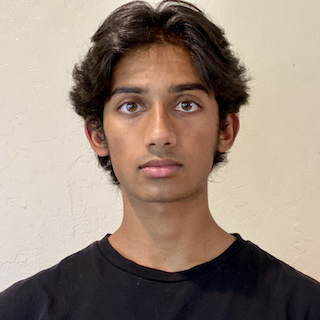

# About me


My name is **Pranav Reddy**.
I am a student at **UCSD** interested in having fun with friends.
My programming interests are mainly in numerical things: optimization, numerical linear algebra, PDE, etc.
C++ is my favorite language, but I think programming language doesn't matter that much; if you know one you know all of them.
My actual website is [here](https://pranavnreddy.github.io/).
For a much shorter version of this site, click [here]((./second_page.md)).

## My interests

I like Hello Kitty and all the Sanrio characters.
My favorite is Pompompurin but I also like Cinnamoroll.
Some of my other interests include
- Running
- Lifting
- Surfing
- Mathematics
  - My top 3 favorite fields are 
    1. Optimization
    2. Linear Algebra
    3. Topology

I need to quote some code to get full credit on this assignment, so here is some code from ECE 285 that uses semidefinite programming to compute an optimal controller for a given linear system:
```
A = [0.71 0.17 0.20 0.99 0.92;
    0.50 0.28 0.62 0.05 0.49;
    0.43 0.59 0.75 0.04 0.79;
    0.19 0.60 0.10 0.43 0.08;
    0.20 0.98 0.62 0.14 0.29];
B = [0.74 0.57;
    0.63 0.91;
    0.21 0.37;
    0.80 0.76;
    0.89 0.40];

x_0 = [1, 1, 1, 2, 3]';
epsilon = 10e-6;
T = 20;

Q = sdpvar(5,5);
Y = sdpvar(2,5);

constraints = [[Q, Q*A'+Y'*B'; A*Q + B * Y, Q] - epsilon*eye(10) >= 0];
cost = [];
option = sdpsettings('solver','mosek');

sol = optimize(constraints, cost, option);

K = value(Y)*value(Q)^-1;

disp(K);
eigval = eig(A+B*K);
disp(eigval)

autonomous_X = zeros(length(x_0), T);
for i=1:T
    autonomous_X(:,i) = (A^(i-1))*x_0;
end

controlled_X = zeros(length(x_0), T);
for i=1:T
    controlled_X(:,i) = ((A+B*K)^(i-1))*x_0;
end

figure()

t = 0:T-1;
hold on
stairs(t, autonomous_X(1,:), 'Linewidth', 2);
stairs(t, autonomous_X(2,:), 'Linewidth', 2);
stairs(t, autonomous_X(3,:), 'Linewidth', 2);
stairs(t, autonomous_X(4,:), 'Linewidth', 2);
stairs(t, autonomous_X(5,:), 'Linewidth', 2);
xlabel('Time, $t$', 'Interpreter','latex')
ylabel('Trajectory, $x_i$', 'Interpreter','latex')
title('No control Input', 'Interpreter','latex')
legend('$x_1$','$x_2$','$x_3$','$x_4$','$x_5$','Interpreter','latex');
% set(hl, 'Interpreter','latex')
grid on
hold off

figure();
hold on
stairs(t, controlled_X(1,:), 'Linewidth', 2);
stairs(t, controlled_X(2,:), 'Linewidth', 2);
stairs(t, controlled_X(3,:), 'Linewidth', 2);
stairs(t, controlled_X(4,:), 'Linewidth', 2);
stairs(t, controlled_X(5,:), 'Linewidth', 2);
xlabel('Time, $t$', 'Interpreter','latex')
ylabel('Trajectory, $x_i$', 'Interpreter','latex')
title('Using controller $K$', 'Interpreter','latex')
legend('$x_1$','$x_2$','$x_3$','$x_4$','$x_5$','Interpreter','latex');
grid on
hold off
```

## More about me
I like Seinfeld.
My favorite quote from it is 
> Yada yada

because it was very funny.

This section is almost over, so please [go back to the start.](#about-me)

You can see proof of all the things I need here:
- [x] Headings (See top)
- [x] Styling text (first paragraph)
- [x] Quoting text ("Yada yada")
- [x] Quoting code (Obvious)
- [x] External Links (first paragraph, link to my website)
- [x] Section links (see above)
- [x] Relative links (linked to [second_page.md](./second_page.md))
- [x] Ordered and Unordered Lists (listed my interests – I even nested lists)
- [x] Task lists (this thing)
